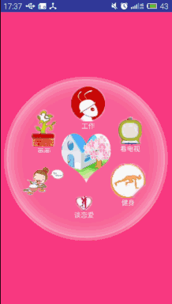

- 示意图
---


---
[参考链接](http://blog.csdn.net/lmj623565791/article/details/43131133)
---
使用方法
---

- 1.首先导入第三方框架library_circle_layout，添加依赖
- 2.在布局文件中添加自定义的圆形布局，如下所示：
```
<LinearLayout xmlns:android="http://schemas.android.com/apk/res/android"
    android:layout_width="match_parent"
    android:layout_height="match_parent"
    android:background="@color/colorAccent"
    android:gravity="center_vertical"
    android:orientation="horizontal" >

    <com.android.tv.settings.library_circle_layout.CircleMenuLayout
        android:id="@+id/id_menulayout"
        android:layout_width="match_parent"
        android:layout_height="match_parent"
        android:padding="100dp"
        android:background="@drawable/circle_bg3" >

        <RelativeLayout
            android:id="@id/id_circle_menu_item_center"
            android:layout_width="wrap_content"
            android:layout_height="wrap_content" >

            <ImageView
                android:layout_width="104.0dip"
                android:layout_height="104.0dip"
                android:layout_centerInParent="true"
                android:background="@drawable/life" />

        </RelativeLayout>
    </com.android.tv.settings.library_circle_layout.CircleMenuLayout>

</LinearLayout>
```
- 注：其中id_circle_menu_item_center的id不能改变，因为·在第三方框架中有引用，在values中的ids.xml中有定义。

- 3 .在代码中使用时：
- (1)首先要绑定CircleMenuLayout的id
- (2)准备转盘中的图片数据和文字标题,如下：
```

    private String[] mItemTexts = new String[] { "吃饭", "画画", "工作",
            "看电视", "健身", "谈恋爱" };
    private int[] mItemImgs = new int[] { R.drawable.eat,
            R.drawable.draw, R.drawable.work,
            R.drawable.tv, R.drawable.body,
            R.drawable.love };
```
-  (3)将准备好的数据源设置进去
```
mCircleMenuLayout.setMenuItemIconsAndTexts(mItemImgs, mItemTexts);
```
-   (4)设置转盘布局的item点击事件
```
 mCircleMenuLayout.setOnMenuItemClickListener(new CircleMenuLayout.OnMenuItemClickListener() {
 			//点击周围的Item
 			@Override
 			public void itemClick(View view, int position) {
 				Toast.makeText( CircleActivity.this,mItemTexts[position],Toast.LENGTH_SHORT).show();
 			}
 //点击中心的Item,跳转到别的界面
 			@Override
 			public void itemCenterClick(View view) {
 				Intent intent =new Intent(CircleActivity.this,SecondActivity.class);
 				startActivity(intent);
 			}
 		});
```